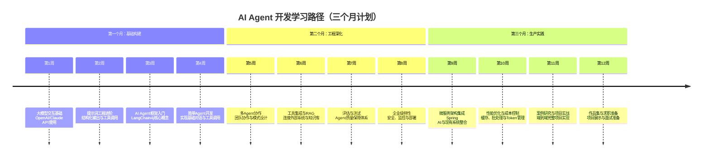

你希望从一名有8年经验的Java程序员转型为AI Agent开发工程师，并且希望在三个月内完成这个转型。这是一个很有挑战性但也非常可行的目标。我会结合2026年7月的最新AI Agent市场落地情况，为你制定一份**详细、循序渐进、工程实施性强且可执行**的学习计划。

# 🚀 Java 程序员转型 AI Agent 开发工程师：三个月冲刺计划

## ✨ 计划概述

你的8年Java经验是你的巨大优势，特别是在**系统设计、微服务、企业级应用和性能调优**方面。AI Agent开发不再是单纯调用API，而是需要**强大的工程化能力**来构建可靠、可扩展的系统。本计划将充分利用你的Java背景，让你快速切入当前AI Agent开发的核心领域。

以下是未来三个月的整体学习路径，帮助你从零开始逐步掌握AI Agent开发的核心技能：



## 🎯 核心学习目标

基于2026年AI Agent市场落地情况，你将重点掌握以下能力：
- **企业级AI Agent开发**：构建满足生产环境要求的智能代理系统
- **多Agent协作模式**：设计并实现能够协同工作的智能代理团队
- **工具调用与RAG集成**：将AI Agent与企业现有系统和知识库深度集成
- **评估与测试体系**：建立完整的AI Agent质量保障流程
- **Java生态整合**：利用Spring AI、LangChain4j等Java优先工具加速开发

## 📚 详细学习计划

### 🗓️ 第一个月：基础构建与框架入门

#### 第1周：大模型交互基础与API使用

作为Java开发者，你需要首先掌握如何与大语言模型进行程序化交互。当前市场主流的API提供商包括OpenAI、Anthropic和Google，但建议从**OpenAI API**开始，因为其生态最成熟、Java SDK支持最好。

| 学习重点 | 推荐资源 | 实践任务 |
| :--- | :--- | :--- |
| OpenAI API基础 | [OpenAI API 官方文档](https://platform.openai.com/docs/api-reference) | 实现简单的文本补全程序 |
| Java SDK使用 | [OpenAI Java SDK GitHub](https://github.com/openai/openai-java) | 创建一个聊天机器人，支持多轮对话 |
| API认证与错误处理 | [API认证指南](https://platform.openai.com/docs/quickstart) | 实现API调用重试机制和错误处理 |

**核心代码示例：使用OpenAI Java SDK进行基础对话**

```java
// 依赖: implementation 'com.openai:openai-java:0.21.0'
import com.openai.client.OpenAIClient;
import com.openai.client.okhttp.OpenAIOkHttpClient;
import com.openai.models.ChatModel;
import com.openai.models.chat.completions.ChatCompletionCreateParams;
public class BasicChatExample {
    public static void main(String[] args) {
        OpenAIClient client = OpenAIOkHttpClient.builder()
                .apiKey(System.getenv("OPENAI_API_KEY"))
                .build();
        ChatCompletionCreateParams params = ChatCompletionCreateParams.builder()
                .model(ChatModel.GPT_4O) // 使用最新GPT-4o模型
                .addUserMessage("你好，请介绍一下你自己。")
                .build();
        client.chat().completions().create(params).choices().stream()
                .flatMap(choice -> choice.message().content().stream())
                .forEach(System.out::println);
    }
}
```

> 💡 **市场洞察**：到2026年7月，GPT-4o已经成为了大多数生产环境的首选模型，因为它在**多模态能力、响应速度和成本效益**之间达到了最佳平衡。对于大多数Agent应用，建议从GPT-4o开始，而不是更强大的模型。

#### 第2周：提示词工程进阶与结构化输出

优秀的AI Agent不仅需要能够理解自然语言，还需要能够**按照特定格式输出结构化数据**，这对于后续的工具调用和数据处理至关重要。

| 学习重点 | 推荐资源 | 实践任务 |
| :--- | :--- | :--- |
| 提示词工程基础 | [OpenAI提示工程指南](https://platform.openai.com/docs/guides/prompt-engineering) | 实现一个JSON格式输出示例 |
| 结构化输出技术 | [结构化输出最佳实践](https://platform.openai.com/docs/guides/structured-outputs) | 创建一个提取简历信息的Agent |
| 函数调用基础 | [函数调用API文档](https://platform.openai.com/docs/guides/function-calling) | 实现一个调用天气查询的Agent |

**核心代码示例：结构化输出与函数调用**

```java
import com.openai.client.OpenAIClient;
import com.openai.models.chat.completions.*;
import com.openai.models.FunctionDefinition;
import com.openai.json.JsonObject;
import java.util.List;
public class FunctionCallingExample {
    public static void main(String[] args) {
        OpenAIClient client = OpenAIOkHttpClient.builder()
                .apiKey(System.getenv("OPENAI_API_KEY"))
                .build();
        // 定义工具函数
        FunctionDefinition weatherFunction = FunctionDefinition.builder()
                .name("get_weather")
                .description("获取指定城市的当前天气")
                .parameters(JsonObject.builder()
                        .addProperty("location", JsonObject.builder()
                                .type("string")
                                .description("城市名称，例如：北京")
                                .build())
                        .requiredProperty("location")
                        .build())
                .build();
        ChatCompletionCreateParams params = ChatCompletionCreateParams.builder()
                .model(ChatModel.GPT_4O)
                .addUserMessage("今天的北京天气怎么样？")
                .tools(List.of(FunctionDefinition.builder()
                        .type("function")
                        .function(weatherFunction)
                        .build()))
                .build();
        client.chat().completions().create(params).choices().stream()
                .flatMap(choice -> choice.message().toolCalls().stream())
                .forEach(toolCall -> {
                    System.out.println("工具调用: " + toolCall.function().name());
                    System.out.println("参数: " + toolCall.function().arguments());
                    
                    // 这里应该调用实际的天气API，然后返回结果给模型
                    String weatherResult = callWeatherAPI(toolCall.function().arguments());
                    
                    // 继续对话，将工具结果返回给模型
                    ChatCompletionCreateParams followUpParams = ChatCompletionCreateParams.builder()
                            .model(ChatModel.GPT_4O)
                            .messages(List.of(
                                    ChatMessage.userMessage("今天的北京天气怎么样？"),
                                    ChatMessage.toolMessage(toolCall.id(), weatherResult)
                            ))
                            .build();
                    
                    client.chat().completions().create(followUpParams).choices().stream()
                            .flatMap(choice -> choice.message().content().stream())
                            .forEach(System.out::println);
                });
    }
    
    private static String callWeatherAPI(String arguments) {
        // 这里实现实际的天气API调用
        return "{\"temperature\": 28, \"condition\": \"晴朗\", \"humidity\": 60}";
    }
}
```

> ⚠️ **注意**：函数调用是AI Agent的核心能力，它允许Agent**自主决定何时以及如何调用外部工具**。掌握这一点后，你就可以构建能够执行实际任务的Agent了。

#### 第3周：AI Agent框架入门 - LangChain4j

虽然你可以直接使用API构建Agent，但使用专门的框架可以大大提高开发效率。对于Java开发者，**LangChain4j**是最佳选择，它提供了丰富的抽象和工具。

| 学习重点 | 推荐资源 | 实践任务 |
| :--- | :--- | :--- |
| LangChain4j核心概念 | [LangChain4j官方文档](https://docs.langchain4j.dev/) | 使用LangChain4j实现简单聊天 |
| 提示词模板管理 | [提示词模板指南](https://docs.langchain4j.dev/tutorials/prompts) | 创建一个有上下文感知的助手 |
| 记忆组件使用 | [记忆管理文档](https://docs.langchain4j.dev/tutorials/memory) | 实现一个能够记住对话历史的Agent |

**核心代码示例：使用LangChain4j构建有记忆的Agent**

```java
// 依赖: implementation 'dev.langchain4j:langchain4j:0.35.0'
import dev.langchain4j.memory.chat.MessageWindowChatMemory;
import dev.langchain4j.model.openai.OpenAiChatModel;
import dev.langchain4j.service.AiServices;
public class LangChain4jMemoryExample {
    public static void main(String[] args) {
        OpenAiChatModel model = OpenAiChatModel.builder()
                .apiKey(System.getenv("OPENAI_API_KEY"))
                .modelName("gpt-4o")
                .build();
        // 创建一个具有记忆能力的AI服务
        Assistant assistant = AiServices.builder(Assistant.class)
                .chatLanguageModel(model)
                .chatMemory(MessageWindowChatMemory.withMaxMessages(10))
                .build();
        // 第一轮对话
        String response1 = assistant.chat("我叫张三，今年30岁，是一名Java开发者。");
        System.out.println("模型: " + response1);
        // 第二轮对话
        String response2 = assistant.chat("我的职业是什么？");
        System.out.println("模型: " + response2); // 应该能够记得你之前的介绍
    }
    interface Assistant {
        String chat(String message);
    }
}
```

> 💡 **市场洞察**：到2026年，**LangChain4j已经成为Java生态中最流行的AI Agent框架**，因为它提供了**类型安全、模块化设计**，并且与Spring Boot等Java企业级框架无缝集成。相比Python的LangChain，它更符合Java开发者的编程习惯。

#### 第4周：简单Agent开发与工具集成

本周你将实现第一个完整的AI Agent，它能够**自主决定何时调用工具**，并处理用户的多轮对话。

| 学习重点 | 推荐资源 | 实践任务 |
| :--- | :--- | :--- |
| Agent架构设计 | [Agent架构模式](https://docs.langchain4j.dev/tutorials/agents) | 设计一个查询新闻的Agent |
| 工具定义与注册 | [工具定义指南](https://docs.langchain4j.dev/tutorials/tools) | 实现一个能够搜索并总结新闻的Agent |
| 错误处理与重试机制 | [错误处理最佳实践](https://docs.langchain4j.dev/tutorials/error-handling) | 添加API调用失败的重试逻辑 |

**核心代码示例：完整的新闻查询Agent**

```java
import dev.langchain4j.agent.tool.Tool;
import dev.langchain4j.memory.chat.MessageWindowChatMemory;
import dev.langchain4j.model.openai.OpenAiChatModel;
import dev.langchain4j.service.AiServices;
import java.time.LocalDate;
import java.util.List;
public class NewsAgentExample {
    public static void main(String[] args) {
        OpenAiChatModel model = OpenAiChatModel.builder()
                .apiKey(System.getenv("OPENAI_API_KEY"))
                .modelName("gpt-4o")
                .build();
        NewsAssistant assistant = AiServices.builder(NewsAssistant.class)
                .chatLanguageModel(model)
                .chatMemory(MessageWindowChatMemory.withMaxMessages(10))
                .tools(new NewsTools())
                .build();
        String response = assistant.searchNews("人工智能", LocalDate.now().minusDays(1));
        System.out.println(response);
    }
    interface NewsAssistant {
        String searchNews(String topic, LocalDate date);
    }
    static class NewsTools {
        @Tool("搜索特定日期的特定主题新闻")
        public List<String> searchNews(String topic, LocalDate date) {
            // 这里实现实际的新闻搜索逻辑
            // 可以调用新闻API或从数据库中检索
            return List.of(
                    "人工智能在医疗领域的应用取得重大突破",
                    "AI辅助编程工具显著提高开发效率",
                    "自然语言处理技术在客服领域表现突出"
            );
        }
    }
}
```

### 🗓️ 第二个月：工程深化与多Agent协作

#### 第5周：多Agent协作模式与团队设计

在现代AI Agent系统中，**多个专门化Agent协作**比单一全能Agent更常见、更有效。本周你将学习如何设计多Agent系统。

| 学习重点 | 推荐资源 | 实践任务 |
| :--- | :--- | :--- |
| 多Agent架构模式 | [多Agent协作指南](https://docs.langchain4j.dev/tutorials/multi-agents) | 设计一个包含研究、写作和编辑Agent的系统 |
| Agent间通信机制 | [Agent通信协议](https://docs.langchain4j.dev/tutorials/agent-communication) | 实现Agent间的消息传递和协调 |
| 协作流程编排 | [工作流设计文档](https://docs.langchain4j.dev/tutorials/workflows) | 创建一个多Agent协作的研究报告生成系统 |

**核心代码示例：多Agent协作系统**

```java
import dev.langchain4j.agent.tool.Tool;
import dev.langchain4j.memory.chat.MessageWindowChatMemory;
import dev.langchain4j.model.openai.OpenAiChatModel;
import dev.langchain4j.service.AiServices;
import java.util.List;
public class MultiAgentExample {
    public static void main(String[] args) {
        OpenAiChatModel model = OpenAiChatModel.builder()
                .apiKey(System.getenv("OPENAI_API_KEY"))
                .modelName("gpt-4o")
                .build();
        // 创建研究Agent
        ResearchAgent researchAgent = AiServices.builder(ResearchAgent.class)
                .chatLanguageModel(model)
                .chatMemory(MessageWindowChatMemory.withMaxMessages(20))
                .tools(new ResearchTools())
                .build();
        // 创建写作Agent
        WritingAgent writingAgent = AiServices.builder(WritingAgent.class)
                .chatLanguageModel(model)
                .chatMemory(MessageWindowChatMemory.withMaxMessages(20))
                .build();
        // 协作流程
        String topic = "人工智能在医疗领域的应用";
        List<String> researchResults = researchAgent.conductResearch(topic);
        String report = writingAgent.writeReport(topic, researchResults);
        
        System.out.println("最终报告:\n" + report);
    }
    interface ResearchAgent {
        List<String> conductResearch(String topic);
    }
    interface WritingAgent {
        String writeReport(String topic, List<String> researchData);
    }
    static class ResearchTools {
        @Tool("搜索学术文献")
        public List<String> searchPapers(String topic) {
            // 实现文献搜索逻辑
            return List.of("论文1: AI在医学影像诊断中的应用", "论文2: 深度学习在药物发现中的作用");
        }
        @Tool("搜索最新新闻")
        public List<String> searchNews(String topic) {
            // 实现新闻搜索逻辑
            return List.of("AI辅助手术精度达到新高度", "机器学习模型预测心脏病风险准确率提高");
        }
    }
}
```

> 🌟 **市场趋势**：到2026年，**多Agent协作已经成为企业级AI应用的标准架构模式**。专门的Agent负责不同领域的任务（如研究、写作、编程、分析），通过协作完成复杂目标。这比单一全能Agent更可靠、更可解释。

#### 第6周：工具集成与RAG（检索增强生成）

生产环境的AI Agent需要与**企业现有系统**深度集成，并能够访问**组织知识库**。RAG技术是实现这一点的关键。

| 学习重点 | 推荐资源 | 实践任务 |
| :--- | :--- | :--- |
| RAG基础概念 | [RAG教程](https://docs.langchain4j.dev/tutorials/rag) | 实现一个基于文档的问答系统 |
| 向量数据库集成 | [向量数据库指南](https://docs.langchain4j.dev/tutorials/vector-databases) | 连接向量数据库并实现语义搜索 |
| 企业系统集成 | [企业集成模式](https://docs.langchain4j.dev/tutorials/enterprise-integration) | 集成企业CRM系统，创建客户服务Agent |

**核心代码示例：RAG实现**

```java
import dev.langchain4j.data.document.Document;
import dev.langchain4j.data.document.DocumentSplitter;
import dev.langchain4j.data.document.splitter.DocumentSplitters;
import dev.langchain4j.data.segment.TextSegment;
import dev.langchain4j.model.embedding.EmbeddingModel;
import dev.langchain4j.model.openai.OpenAiEmbeddingModel;
import dev.langchain4j.store.embedding.EmbeddingStore;
import dev.langchain4j.store.embedding.EmbeddingStoreIngestor;
import dev.langchain4j.store.embedding.inmemory.InMemoryEmbeddingStore;
public class RAGExample {
    public static void main(String[] args) {
        // 1. 初始化嵌入模型和存储
        EmbeddingModel embeddingModel = OpenAiEmbeddingModel.builder()
                .apiKey(System.getenv("OPENAI_API_KEY"))
                .modelName("text-embedding-3-small")
                .build();
        EmbeddingStore<TextSegment> embeddingStore = new InMemoryEmbeddingStore<>();
        // 2. 加载文档并分割
        Document document = Document.from("企业政策文档内容...");
        DocumentSplitter splitter = DocumentSplitters.recursive(500, 50);
        List<TextSegment> segments = splitter.split(document);
        // 3. 将文档片段嵌入并存储
        EmbeddingStoreIngestor.ingest(embeddingModel, embeddingStore, segments);
        // 4. 查询相关内容
        String query = "公司的报销政策是什么？";
        List<EmbeddingMatch<TextSegment>> relevant = EmbeddingStoreRelevantRetriever.builder()
                .embeddingStore(embeddingStore)
                .embeddingModel(embeddingModel)
                .maxResults(3)
                .minScore(0.7)
                .build()
                .findRelevant(query);
        // 5. 使用检索到的上下文回答问题
        String context = relevant.stream()
                .map(match -> match.embedded().text())
                .collect(Collectors.joining("\n\n"));
        ChatModel chatModel = OpenAiChatModel.builder()
                .apiKey(System.getenv("OPENAI_API_KEY"))
                .modelName("gpt-4o")
                .build();
        String response = chatModel.generate(
                SystemMessage.from("你是一个企业助手，请根据以下上下文回答用户问题："),
                UserMessage.from("上下文：\n" + context + "\n\n问题：" + query)
        );
        System.out.println(response);
    }
}
```

> 💡 **市场洞察**：到2026年，**RAG已经成为企业知识管理的基础设施**。几乎所有大型企业都已经建立了自己的向量数据库和知识图谱，AI Agent通过RAG能够访问企业内部知识，提供更加准确和相关的回答。

#### 第7周：评估与测试体系

AI Agent的质量保障比传统软件更复杂，需要专门的**评估框架和测试方法**。

| 学习重点 | 推荐资源 | 实践任务 |
| :--- | :--- | :--- |
| Agent评估指标 | [评估框架指南](https://docs.langchain4j.dev/tutorials/evaluation) | 定义一个Agent的评估指标体系 |
| 自动化测试方法 | [自动化测试文档](https://docs.langchain4j.dev/tutorials/testing) | 为你的新闻Agent创建单元测试和集成测试 |
| 人工评估流程 | [人工评估最佳实践](https://docs.langchain4j.dev/tutorials/manual-evaluation) | 设计一个Agent回答质量评分系统 |

**核心代码示例：Agent评估测试**

```java
import dev.langchain4j.agent.tool.Tool;
import dev.langchain4j.model.chat.ChatLanguageModel;
import dev.langchain4j.model.openai.OpenAiChatModel;
import dev.langchain4j.service.AiServices;
import org.junit.jupiter.api.Test;
import static org.junit.jupiter.api.Assertions.*;
public class AgentEvaluationTest {
    
    @Test
    public void testToolCalling() {
        ChatLanguageModel model = OpenAiChatModel.builder()
                .apiKey(System.getenv("OPENAI_API_KEY"))
                .modelName("gpt-4o")
                .build();
        TestAgent agent = AiServices.builder(TestAgent.class)
                .chatLanguageModel(model)
                .tools(new TestTools())
                .build();
        String response = agent.executeTask("计算123和456的和");
        assertNotNull(response);
        assertTrue(response.contains("579"));
    }
    interface TestAgent {
        String executeTask(String task);
    }
    static class TestTools {
        @Tool("计算两个数的和")
        public int add(int a, int b) {
            return a + b;
        }
    }
}
```

#### 第8周：企业级特性：安全、监控与部署

生产环境中的AI Agent需要考虑**安全性、监控和可观测性**。

| 学习重点 | 推荐资源 | 实践任务 |
| :--- | :--- | :--- |
| Agent安全最佳实践 | [安全指南](https://docs.langchain4j.dev/tutorials/security) | 实现输入验证和输出过滤机制 |
| 监控与日志记录 | [监控框架文档](https://docs.langchain4j.dev/tutorials/monitoring) | 添加Agent调用日志和性能监控 |
| 部署策略 | [部署指南](https://docs.langchain4j.dev/tutorials/deployment) | 使用Docker容器化你的Agent应用 |

### 🗓️ 第三个月：生产实践与项目整合

#### 第9周：微服务架构集成与Spring AI

作为Java开发者，你很可能工作在微服务架构环境中。本周你将学习如何将AI Agent集成到**Spring Boot应用**中。

| 学习重点 | 推荐资源 | 实践任务 |
| :--- | :--- | :--- |
| Spring AI基础 | [Spring AI官方文档](https://docs.spring.io/spring-ai/reference/) | 创建一个Spring Boot AI应用 |
| Agent作为微服务 | [微服务架构文档](https://docs.spring.io/spring-ai/reference/integration/spring-boot.html) | 将Agent设计为Spring Boot微服务 |
| 服务间通信 | [服务通信指南](https://docs.spring.io/spring-ai/reference/integration/rest.html) | 实现Agent服务的REST API |

**核心代码示例：Spring Boot中的AI服务**

```java
import org.springframework.ai.chat.client.ChatClient;
import org.springframework.web.bind.annotation.*;
@RestController
@RequestMapping("/api/agent")
public class AgentController {
    
    private final ChatClient chatClient;
    
    public AgentController(ChatClient.Builder chatClientBuilder) {
        this.chatClient = chatClientBuilder.build();
    }
    
    @PostMapping("/chat")
    public String chat(@RequestBody String message) {
        return chatClient.prompt()
                .user(message)
                .call()
                .content();
    }
}
// application.yml
// spring:
//   ai:
//     openai:
//       api-key: ${OPENAI_API_KEY}
//       chat:
//         options:
//           model: gpt-4o
```

> 💡 **市场洞察**：到2026年，**Spring AI已经成为Java企业级AI应用的事实标准**。它提供了与Spring生态系统无缝集成的抽象，使得将AI功能添加到现有Spring应用变得非常简单。

#### 第10周：性能优化与成本控制

AI Agent应用的**性能和成本控制**是生产环境中的关键考虑因素。

| 学习重点 | 推荐资源 | 实践任务 |
| :--- | :--- | :--- |
| Token使用优化 | [成本优化指南](https://docs.langchain4j.dev/tutorials/cost-optimization) | 实现提示词压缩和缓存策略 |
| 响应时间优化 | [性能优化文档](https://docs.langchain4j.dev/tutorials/performance) | 添加流式响应和异步处理 |
| 批处理与并行处理 | [批处理模式](https://docs.langchain4j.dev/tutorials/batch-processing) | 实现批量请求处理 |

#### 第11周：案例研究与项目实战

本周你将构建一个**完整的端到端项目**，整合所学所有知识。

| 项目类型 | 技术点 | 实施步骤 |
| :--- | :--- | :--- |
| **企业知识库助手** | RAG、Spring Boot、多Agent协作 | 1. 设计知识库结构<br>2. 实现文档索引和检索<br>3. 创建问答Agent<br>4. 添加用户界面 |
| **客户服务Agent** | 对话管理、工具集成、情感分析 | 1. 设计对话流程<br>2. 集成CRM系统<br>3. 实现情感分析<br>4. 添加转人工逻辑 |
| **代码助手Agent** | 代码分析、生成、调试 | 1. 实现代码理解<br>2. 添加代码生成能力<br>3. 集成调试工具<br>4. 创建测试用例 |

#### 第12周：作品集与求职准备

最后一周，你将完善项目并准备求职。

| 准备内容 | 具体行动 |
| :--- | :--- |
| 项目完善 | 确保项目代码质量高、文档完善、有清晰的README |
| 演示准备 | 准备项目演示视频和在线演示环境 |
| 简历优化 | 突出你的Java背景和AI Agent开发经验 |
| 技术面试准备 | 准备常见的AI Agent技术面试问题和答案 |

## 🛠️ 推荐工具与框架

基于2026年7月的Java AI Agent开发生态，以下是核心工具和框架：

| 工具/框架 | 主要用途 | 学习优先级 |
| :--- | :--- | :--- |
| **LangChain4j** | AI Agent开发框架 | ⭐⭐⭐⭐⭐ 必须掌握 |
| **Spring AI** | Spring生态系统集成 | ⭐⭐⭐⭐⭐ 必须掌握 |
| **OpenAI Java SDK** | 大模型API调用 | ⭐⭐⭐⭐⭐ 必须掌握 |
| **Milvus** / **Pgvector** | 向量数据库 | ⭐⭐⭐⭐ 推荐掌握 |
| **LangSmith** | Agent调试与监控 | ⭐⭐⭐⭐ 推荐掌握 |
| **Testcontainers** | 集成测试 | ⭐⭐⭐ 推荐掌握 |
| **Docker & Kubernetes** | 容器化与部署 | ⭐⭐⭐ 推荐掌握 |

## 📖 学习资源汇总

### 官方文档与教程

-   [LangChain4j官方文档](https://docs.langchain4j.dev/) - 最全面的Java AI Agent开发指南
-   [Spring AI官方文档](https://docs.spring.io/spring-ai/reference/) - Spring生态系统AI集成指南
-   [OpenAI API文档](https://platform.openai.com/docs/) - 大模型API权威文档
-   [Anthropic Claude文档](https://docs.anthropic.com/) - Claude模型API文档

### 在线课程与实战

-   [DeepLearning.AI AI Agent课程](https://www.deeplearning.ai/short-courses/building-agentic-rag-with-llamaindex/) - AI Agent与RAG实战课程
-   [Coursera AI Agent开发](https://www.coursera.org/learn/ai-agents) - 系统性AI Agent课程
-   [Udemy Java AI开发](https://www.udemy.com/topic/java/artificial-intelligence/) - Java AI开发实战课程

### 社区与博客

-   [LangChain4j GitHub](https://github.com/langchain4j/langchain4j) - 查看最新示例和问题讨论
-   [Spring AI博客](https://spring.io/blog/topics/ai/) - Spring AI最新动态和教程
-   [Medium AI Agent专栏](https://medium.com/tag/ai-agents) - AI Agent开发经验和案例分享

## 💡 职业发展建议

1. **利用Java背景优势**：强调你的**企业级应用开发经验**，这是大多数AI Agent项目成功的关键。大多数AI Agent项目最终会失败，不是因为模型不够聪明，而是因为工程化能力不足。
2. **选择AI Agent框架**：对于Java开发者，**LangChain4j和Spring AI**是最佳选择。它们提供了类型安全、模块化设计，并且与Java企业级生态系统无缝集成。
3. **构建作品集**：创建**2-3个完整的AI Agent项目**，展示不同方面的能力（如RAG、多Agent协作、企业系统集成）。项目应该有清晰的README、演示视频和在线演示。
4. **关注企业级需求**：当前企业最关心的AI Agent能力包括：
    - **与现有系统集成**（CRM、ERP、数据库等）
    - **数据安全和隐私保护**
    - **可观测性和监控**
    - **成本控制和性能优化**
    - **符合行业法规要求**
5. **准备求职面试**：准备以下技术问题的答案：
    - 如何设计一个AI Agent系统？
    - 如何处理Agent的幻觉问题？
    - 如何评估Agent的性能？
    - 如何优化Token使用成本？
    - 如何实现Agent的记忆功能？

## 🎯 三个月后的技能评估标准

完成三个月学习后，你应该能够：

-   ✅ **独立设计和实现**完整的AI Agent系统
-   ✅ **集成多种外部工具**和API（数据库、REST服务、向量数据库等）
-   ✅ **实现RAG系统**，让Agent能够访问企业知识库
-   ✅ **设计和实现**多Agent协作系统
-   ✅ **评估和测试**Agent性能，识别和修复问题
-   ✅ **部署和监控**生产环境中的AI Agent
-   ✅ **优化性能和成本**，使系统满足生产要求

> 💡 **最后建议**：AI Agent开发是一个快速发展的领域，保持持续学习非常重要。建议你定期阅读最新研究论文、关注开源项目动态、参与社区讨论，这样才能跟上技术发展的步伐。

祝你在AI Agent开发的学习道路上取得成功！你的Java背景将是你的巨大优势，相信你很快就能成为一名优秀的AI Agent开发工程师。


